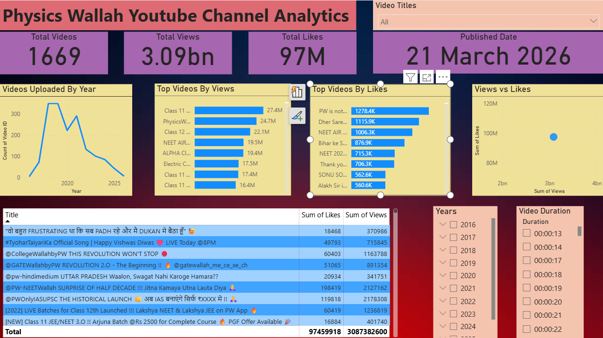

# Youtube Channel Tracker(Phyics Wallah Analytics)

This project is an end-to-end data analytics pipeline that extracts, processes, and visualizes the Physics Wallah YouTube channel data using Python, MySQL, and Power BI

## Dashboard Preview

## Project Highlights

- Built an end-to-end data pipeline using the YouTube Data API
- Automated data collection using Python scripts
- Stored structured data in a MySQL database
- Designed an interactive Power BI dashboard
- Analyzed video performance, trends, and engagement metrics

## Tech Stack

- Python (requests, pandas, isodate)
- MySQL
- Power BI
- YouTube Data API

## Project Structure

- 'src/' -> Python source files
- 'data/' -> CSV output file
- 'dashboard/' -> Power BI dashboard
- 'database/' -> MySQL schema file

## Workflow

- YouTube API -> Python Scripts -> MySQL Database -> CSV -> Power BI dashboard

## Key Insights

- Identified top-performing videos based on views and likes
- Found engagement ratio trends (Likes/Views)
- Analyzed upload frequency pattern over time
- Discovered peak publishing periods for higher engagement

## How to Run

1. Clone the repository
2. Navigate to the project folder
3. Install dependencies
4. Add your YouTube API key to the script
5. Run the Python scripts from 'src/' (api.py -> data_fetching.py)
6. Check the generated CSV in 'data/'
7. Import schema from `database/schema.sql` into MySQL
8. Open Power BI dashboard from `dashboard/pw_visuals.pbix`

## Future Improvements

- Deploy dashboard online (Power BI Service)
- Add sentiment analysis on video comments
- Build a web dashboard using Streamlit

## Author

Akshat Jain  
Aspiring Data Analyst | Python | SQL | Power BI
